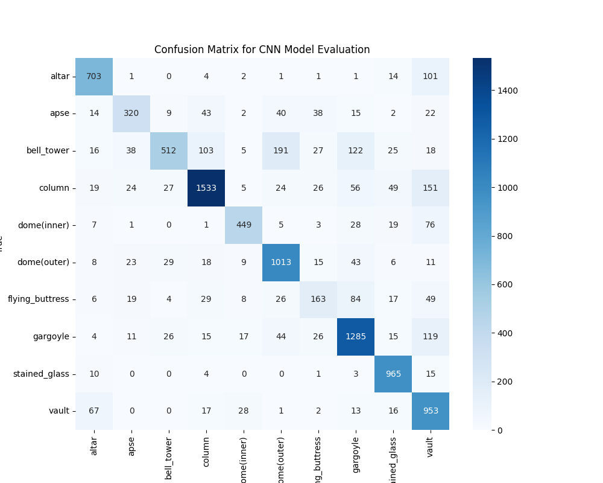

# CNN Model for Architectural Heritage Elements Classification

This project involves the development of a Convolutional Neural Network (CNN) for classifying images of architectural heritage elements from the "Architectural Heritage Elements Image64" dataset. The goal is to train a CNN model, evaluate its performance, and visualize the feature maps produced by the model.

## Overview

The project is divided into three primary objectives:

1. **CNN Model Training**: Build and train a CNN model to classify architectural elements into ten categories.
2. **Deconvolution Visualization**: Visualize the feature maps generated by the CNN model to understand which features the model focuses on during classification.
3. **Image Generation for Specific Classes**: Use the trained CNN to generate images corresponding to specific categories.

### Dataset

The dataset used for this project is the "Architectural Heritage Elements Image64 Dataset," which contains 10,235 images classified into 10 categories of architectural elements. The categories are:

- Altar
- Apse
- Bell Tower
- Column
- Dome (Inner)
- Dome (Outer)
- Flying Buttress
- Gargoyle
- Stained Glass
- Vault

You can download the dataset from [here](https://www.kaggle.com/datasets/ikobzev/architectural-heritage-elements-image64-dataset).

### Model Architecture

The CNN model consists of several layers:

- **Convolutional layers** to extract features.
- **Max-pooling layers** to reduce dimensionality and retain important features.
- **Fully connected layers** for classification.

### Model Training

The model is trained using the following process:

- Data preprocessing: Resizing and normalizing images.
- Data augmentation: Random rotations and flips.
- Optimizer: Adam optimizer.
- Loss function: Categorical cross-entropy.

### Model Evaluation

The model's performance is evaluated using:

- **Confusion Matrix** to understand classification performance across different categories.
- **Metrics** such as accuracy, precision, recall, and F1-score.

You can view the confusion matrix and feature map visualizations below.

### Results

The model successfully classifies architectural heritage elements with high accuracy. The confusion matrix below shows the model's performance across the 10 categories.



Feature maps from the first convolutional layer reveal that the model focuses on edges and textures.


### Requirements

- Python 3.x
- TensorFlow or PyTorch
- Matplotlib
- NumPy
- Pandas
- scikit-learn

### Installation

Clone this repository to your local machine:

```bash
git clone https://github.com/yourusername/architectural-heritage-classification.git
cd architectural-heritage-classification
```

Install the required dependencies:

```bash
pip install -r requirements.txt
```

### Running the Code

1. Download the dataset from [here](https://www.kaggle.com/datasets/ikobzev/architectural-heritage-elements-image64-dataset).
2. Preprocess the images as described in the "Model Training" section.
3. Train the model using the provided training script.
4. Evaluate the model and visualize the results.

### License

This project is licensed under the MIT License - see the [LICENSE](LICENSE) file for details.

### Acknowledgments

- **Dataset**: [Architectural Heritage Elements Image64 Dataset on Kaggle](https://www.kaggle.com/datasets/ikobzev/architectural-heritage-elements-image64-dataset)
- **Frameworks**: PyTorch, TensorFlow
